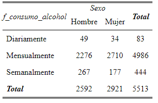
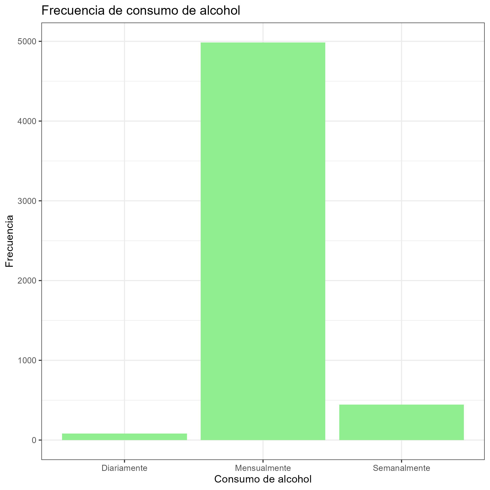
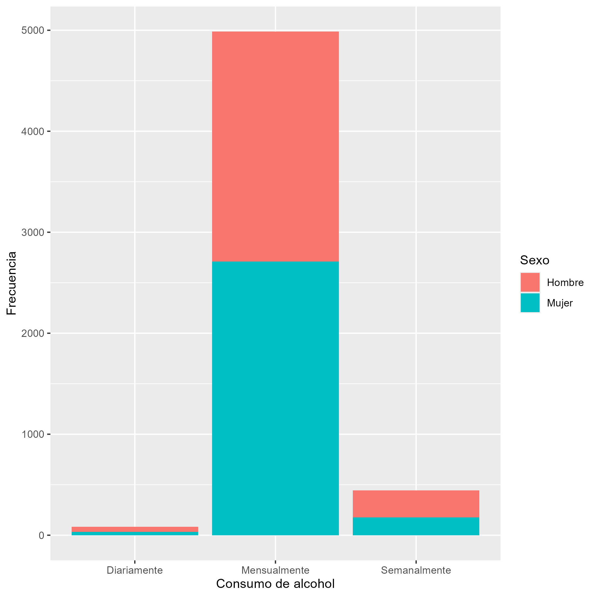

# Introducción

Las políticas públicas para la moderación del consumo de alcohol u otras sustancias suelen estar destinadas para un público general y no reparan en focalizaciones necesarias que existen en base al género. Creemos que este análisis puede ser un aporte para formar un posible perfil, en base al sexo de consumidores de bebidas alcoholicas.

Para ello, se llevó a cabo una investigación sobre la influencia que tiene el sexo de una persona con la frecuencia en la que consume alcohol, utilizando la base de datos pública de la décima Encuesta Nacional de Juventudes del año 2022. Específicamente, la base de datos para jóvenes.

## Presentación de Variables

::: incremental
-  Sexo: nivel de medición nominal (hombre, mujer).

-  Frecuencia de consumo de alcohol: nivel de medición ordinal (Diariamente, mensualmente, semanalmente).
:::

## Tabla de contingencia

:::: {.columns}
::: {.column width="50%"}
En todos los casos las mujeres tienen un menor consumo de alcohol que los hombres. Ademas, la mayor cantidad de mujeres se posiciona en la opción que demuestra menos consumo de alcohol, siendo esta de manera mensual. Esto puede deberse a que los hombres esconden sus sentimientos, por su dificultad al pedir ayuda y terminan compensando sus malestares por otros medios. A la vez, según [@ramos-lira], la depresión puede estar escondida, detrás de comportamientos adictivos y de riesgos.
:::

::: {.column width="50%"}
{width="606"}
:::
:::::

## Gráfico 1

:::: {.columns}
::: {.column width="60%"}
Los resultados resultan novedosos, ya que, como percepción previa, se tenía la noción de que en la sociedad chilena el consumo de alcohol es bastante normalizado para los panoramas sociales, por lo que se esperaba que la moda se encontrara en la categoría de consumo semanal. Teniendo en cuenta la visibilización que tienen este tipo de productos por medio de la publicidad y su presencia en medios de comunicación, se "incrementa la probabilidad de que los adolescentes comiencen a consumir esta droga. De acuerdo a esto, se estaría configurando un escenario propicio de acceso y normalización del consumo de alcohol desde la adolescencia para ambos géneros". [@cabanillas-rojas2020] 
:::

::: {.column width="40%"}

:::
:::::

## Gráfico 2

::::: columns
::: {.column width="50%"}
Por otra parte, los resultados de este gráfico siguen siendo preocupantes para la población masculina, ya que la mayoría de los/as encuestados/as que responden que su consumo es diario antes que mensual o semanal, son hombres. Esto sólo sigue explicando la tendencia adictiva que tiene este género por las atribuciones socioculturales que se tienen hacia su rol, con expectativas que llevan prácticas de este tipo.
:::

::: {.column width="50%"}

:::
:::::

# Conclusión

A modo de concluir, creemos que es evidente que el sexo de una persona y su respectiva socialización afecta en la relación que establece con el consumo de alcohol. Claramente, hay fundamentos socioculturales en nuestra sociedad que explican y sostienen este fenómeno, reproduciéndolo día a día, por lo que consideramos importantes que, para el abordaje de esta temática, se considere la perspectiva de género.
